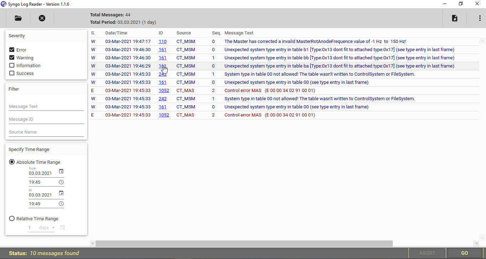

# Syngo Log Reader   

Convenient app for reading service logs generated by Syngo-enabled Siemens medical devices

## What is this and What is it for?
Most large Siemens-made medical imaging devices like CT or MRT scanners operate under the common software shell (platform) called "Syngo''. Syngo unifies user experience, both medical part used by medical personnel, and service part, used for device tune-up, adjustments or repairs, usually used by technical staff, commonly referred as CSEs (Customer Service Engineers) or FSE (Field Service Engineers). 

The most essential part of the service Syngo interface is the system event log. Any repair or adjustment starts from evaluating the event log. Any events, successful or errors, are reflected in the error log. Integrated Syngo Event Log Reader is very similar to the Windows Event Viewer.

Most versions of integrated Syngo Log Readers are able to export event logs to a file. Depending on the Syngo version, an export file can be in the plain text (ASCII) or XML formats, as is or compressed with Zip or Gzip. However, as far as I know, an external reader for those files does not exist. User can import such files to another machine to read (with some tricks) or has to evaluate them using common tools like Notepad. This is very much inconvenience due to lack of filtetring and proper formatting.

This stand-alone Syngo Log Reader is for reading such service log files and provides a very similar, very familiar user experience to the original integrated Syngo Log Reader. I assume this utility can be useful for CSEs, FSEs or remote support services. 

## Quick Start
The latest release is published on the [repository releases page](https://github.com/nikriaz/SyngoLogReader/releases). Just download the archive, unzip it to any folder you wish. This is a portable app so no installation required, just run an \*.exe file and you are in the familiar Syngo Log Reader!

The .Net 5 framework is required. If it's not yet installed then you will be prompted to install the latest version from [official Microsoft .Net 5 site](https://dotnet.microsoft.com/download/dotnet/5.0) automatically. This build is Windows x32 and x64 compatible with any versions where .Net 5 can be installed. Please let me know if you want to get a Linux-compatible app, this is possible too.

## Useful features
Most of these features do not exist in the integrated reader:
* Automatic file format recognition - plain text (ASCII), XML, compressed or not. No file extension is required or considered. Important because exports often do not maintain proper file extension. 
*  XML sanitizing. Some Syngo versions can write XML files with errors so the utility will attempt to correct them.
*  Very fast - sometimes dramatically faster than the original reader - e.g. 2 seconds instead of 2 minutes for the same filter operation.
*  Smart (Google-like) message text field search. Wildcards (\*, ?) and logical operators (OR, AND) are supported too. 
*  Alike-search in the source name field - case-insensitive and by part of the source name.
*  Merging a few files into a single data array. Few exports can be evaluated together.
*  Export current view into XML file in the Syngo file format. Utility can be used for merging, filtering, sanitizing or conversion from plain text to the original XML file format for the further evaluation e.g. on a machine.
*  Some useful current log statistics

# Who am I and Why did I create this utility?

I'm passionate Siemens CSE (AX, CT and MI) so I just found that I need such utility. I am also very keen on IT and C# so this is a dream attempt to merge those two worlds. Also, this small-scale but interesting project is a showcase of my abilities and style in programming. Feel free to contact me in case of some job offers, project offers, start-ups or further emerging of this log reader project.

# Technologies inside
Just in case if you are curious how the utility was built:
* .NET 5 (Formerly known as .NET Core) for desktop as a base. The language is C#
* WPF-based User Interface 
* MDIX (Material Design In XAML) UI design framework
* MVVM (Model-View-ViewModel) UI pattern, native (no frameworks used)
* Most of the code is asynchronous (Async/Await)
* Dependency Injection (DI) pattern, native, Microsoft-based. Honestly, it was certainly excessive for this project :)
* SQLite as database engine, with FTS (Free-Text-Search) feature used and with in-memory database. Runtime migrations as an integration with EF Core. 
* EF Core 5 as ORM

What was planned but not implemented (yet):
* Faster plain text parsing with new Span\<T> and/or parallel loops
* Faster db insert with [SqliteCommand.Prepare() and PRAGMA](https://www.bricelam.net/2017/07/20/sqlite-bulk-insert.html)
* Faster db read with Dapper (instead of EF Core)
